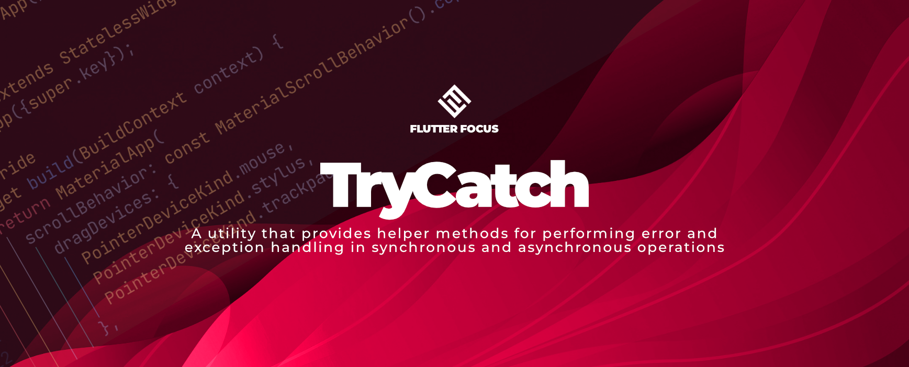

# TryCatch



[](https://youtube.com/@flutterfocus) [](https://twitter.com/flutterfocus) [](https://discord.gg/rx8mzKzjFM) [](https://reddit.com/user/flutterfocus)

A utility class that provides helper methods for performing error handling
and exception handling in synchronous and asynchronous operations.

## Features
- Peovides both asynchronous and synchronous methods
- Upfront handling of common cases from execution to success/failure

## Usage

### TryCatch.async()

Use the `async` method to wrap a `Future` operation and handle errors and
exceptions that may occur during the operation's execution. You can set
callbacks to handle different types of outcomes, such as `onSuccess` for
successful operations, `onError` for unhandled exceptions, `onTimeout` for
operations that exceed a given timeout, and others.

```dart
TryCatch.async<int?>(
  future: Future.value(100),
  timeout: const Duration(seconds: 10),
  onNull: () => print('Null'),
  onTimeout: () => print('Timeout'),
  onError: (e, s) => print('Error: $e'),
  onWaiting: () => print('Awaitng future'),
  onEmpty: () => print('Empty Map or List'),
  onSuccess: (d) => print('Data: $d'),
);
```

### TryCatch.sync()

/// Use the `sync` method to wrap a synchronous operation and handle errors and
/// exceptions that may occur during its execution. You can set callbacks to
/// handle different types of outcomes, such as `onSuccess` for successful
/// operations, `onError` for unhandled exceptions, and others.

```dart
TryCatch.sync<int?>(
  operation: () => someFunction(),
  onNull: () => print('Null'),
  onError: (e, s) => print('Error: $e'),
  onEmpty: () => print('Empty Map or List'),
  onSuccess: (d) => print('Data: $d'),
);
```

### ❤️  Support Flutter Focus
- 🚀 [Github Sponsors](https://github.com/sponsors/flutterfocus)

### Need Mobile, Web or Video marketing services? 📱 🌐 📹
Flutter Focus offers bespoke services in multimedia storytelling by mixing Mobile, Web and Video.

[Find out more](https://flutterfocus.dev/services/).

